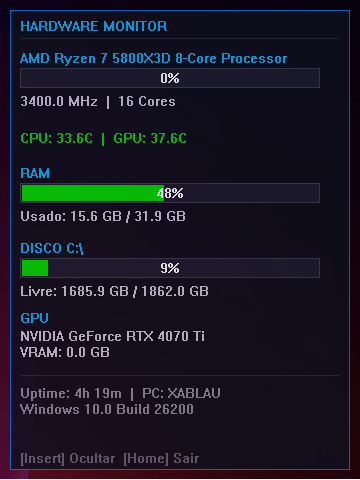

# 🖥️ HardwareProfiler


## 📊 Sobre o Projeto

**HardwareProfiler** é uma ferramenta de monitoramento de hardware em tempo real para Windows, desenvolvida em C++ com overlay GDI. Exibe métricas críticas do sistema de forma não-intrusiva e profissional, similar a overlays de jogos (MSI Afterburner, RivaTuner).

### ✨ Funcionalidades

- 📈 **Monitoramento em tempo real**: CPU (uso, frequência, núcleos, nome), RAM (uso, total, usado), Disco (uso, espaço livre), GPU (nome, VRAM)
- 🌡️ **Temperatura**: Leitura via WMI com fallback inteligente
- 🎨 **Overlay GDI**: Janela transparente e sempre no topo (WS_EX_TOPMOST)
- 🖱️ **Arrastável**: Clique e arraste para posicionar onde quiser
- 🔘 **Bandeja do Sistema**: Ícone na bandeja com duplo clique para mostrar/ocultar
- ⌨️ **Hotkeys Globais**: `Insert` para mostrar/ocultar, `Home` para sair
- 📜 **Texto Rolante**: Nome do processador rola horizontalmente se for muito longo
- ⚡ **Baixo consumo**: Otimizado para rodar em background com 4 FPS

## 📸 Screenshots



## 🛠️ Tecnologias Utilizadas

| Tecnologia | Finalidade |
|------------|------------|
| **C++17** | Linguagem principal |
| **Windows API (Win32)** | Criação de janelas, GDI, mensagens |
| **PDH (Performance Data Helper)** | Leitura de uso da CPU |
| **WMI (Windows Management Instrumentation)** | Leitura de GPU, temperatura, nome da CPU |
| **GDI (Graphics Device Interface)** | Renderização do overlay |
| **Double-buffering** | Eliminação de flicker |

## 🏗️ Arquitetura do Projeto

### Estrutura de Arquivos
HardwareProfiler/
├── main.cpp # Ponto de entrada (WinMain)
├── hardware_profiler.h/cpp # Coleta de métricas (CPU, RAM, Disco, GPU, Temp)
├── overlay.h/cpp # Overlay GDI, renderização, interação
├── README.md # Documentação
├── LICENSE # MIT License
└── HardwareProfiler.sln # Projeto Visual Studio

### Fluxo de Dados

O programa funciona em três camadas principais:

#### 1. Coleta de Dados (Thread separada - 1 segundo)

| Componente | Fonte de Dados |
|------------|----------------|
| **CPU** (uso, frequência, núcleos) | PDH (Performance Data Helper) |
| **RAM** (total, usado, livre) | GlobalMemoryStatusEx |
| **Disco** (uso, espaço livre, FS) | GetDiskFreeSpaceExW |
| **GPU** (nome, VRAM) | WMI (Win32_VideoController) |
| **Temperatura** (CPU/GPU) | WMI (MSAcpi_ThermalZoneTemperature) |
| **Nome da CPU** | WMI (Win32_Processor) + Registro |

#### 2. Renderização (Overlay GDI - 4 FPS)

| Componente | Exibição |
|------------|----------|
| **CPU** | Nome do processador (texto rolante) + barra de uso + frequência + núcleos |
| **RAM** | Barra de uso + total em GB |
| **Disco** | Barra de uso + espaço livre em GB |
| **GPU** | Nome + VRAM em GB |
| **Temperatura** | CPU e GPU em Celsius |
| **Sistema** | Uptime + Nome do PC + Versão do Windows |

#### 3. Interação com o Usuário

| Controle | Ação |
|----------|------|
| **Insert** | Mostrar/Ocultar overlay |
| **Home** | Sair do programa |
| **Bandeja (duplo clique)** | Mostrar/Ocultar overlay |
| **Bandeja (clique direito)** | Sair do programa |
| **Arrastar (title bar)** | Reposicionar overlay |

### Decisões Técnicas

| Decisão | Motivo |
|---------|--------|
| **WinMain** | Aplicação GUI sem console |
| **WS_EX_TOPMOST** | Overlay sempre visível |
| **Double-buffering** | Elimina flicker no desenho |
| **Média móvel da CPU** | Suaviza oscilações |
| **Fallbacks (WMI/Registro)** | Compatibilidade com qualquer hardware |
| **MsgWaitForMultipleObjects** | Baixo consumo de CPU |
| **Hotkeys globais** | Funcionam mesmo com overlay oculto |
| **Bandeja do sistema** | Programa roda em segundo plano |

## 🔧 Como Compilar

### Pré-requisitos
- Visual Studio 2022 (Community Edition ou superior)
- Windows 10 ou superior

### Passos para Compilar

**1. Clone o repositório**
```bash
git clone https://github.com/seu-usuario/HardwareProfiler.git
```

**2. Abra o projeto**
- Navegue até a pasta do projeto
- Abra o arquivo `HardwareProfiler.sln` no Visual Studio

**3. Compile**
- Pressione `Ctrl + Shift + B`
- Ou vá em **Build → Build Solution**

**4. Execute**
- Pressione `F5` para executar com debug
- Ou navegue até `x64/Debug/HardwareProfiler.exe`

---

## 🎮 Como Usar

| Tecla | Ação |
|-------|------|
| **Insert** | Mostrar/Ocultar o overlay |
| **Home** | Fechar o programa |
| **Duplo clique na bandeja** | Restaurar o overlay |
| **Clique direito na bandeja** | Fechar o programa |

---

## 📄 Licença

Este projeto está sob a licença MIT. Veja o arquivo [LICENSE](LICENSE) para mais detalhes.

---

**Desenvolvido por [Seu Nome]**  
[](https://linkedin.com/in/seu-perfil)
[](https://github.com/seu-usuario)
